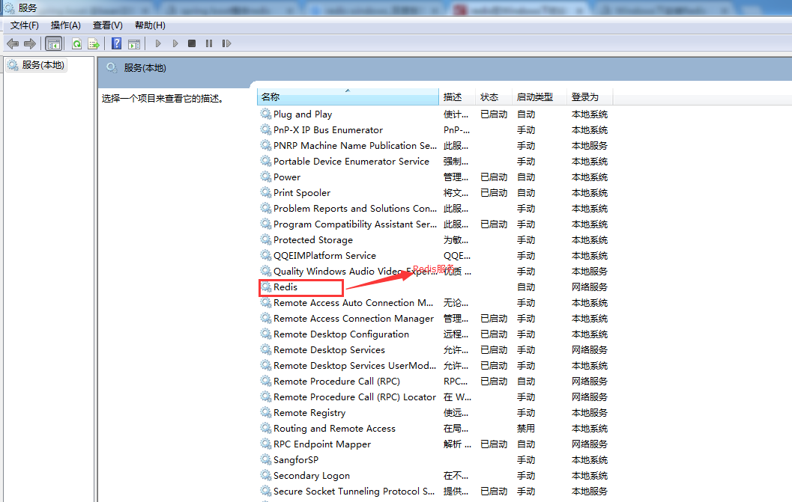

#Windows下安装Redis
转载：https://www.cnblogs.com/panter/p/6801210.html
#一、Redis简单介绍：
　　Redis是一个Key-value的数据结构存储系统，可以以数据库的形式，缓存系统，消息处理器使用，它支持的存储value类型很多，例如，string、list(链表)、set(集合)、zset(sorted set--有序集合)、hash(哈希类型)等。
#二、Windows下安装Redis:
　　去官网找了很久，发现原来在官网上可以下载的windows版本的，现在官网以及没有下载地址，只能在github上下载，官网只提供linux版本的下载

　　官网下载地址：http://redis.io/download

　　github下载地址：https://github.com/MSOpenTech/redis/tags

　　下载Redis-x64-3.2.100.zip文件之后直接解压到指定目录就完成了Redis的安装了，解压成功后，在解压后的文件夹中有几个可执行文件如下：
* redis-server.exe:服务程序；
* redis-check-aof.exe:更新日志检查；
* redis-benchmark.exe:性能测试，用于模拟同时由N个客户端发送M个set/get查询；
* redis-cli.exe:服务端开启后，我们的客户端就可以输入各种命令测试。
#三、使用命令窗口运行redis服务：
##1.进入解压好的文件

##2、启动命令
　　运行redis-server redis.windows.conf，启动redis服务，出现下图显示表示启动成功了。此时当关闭命令窗口redis服务也回关闭

#四、设置Redis服务
##1. 检查是否是后台服务 
　　由于上面虽然启动了redis，但是只要一关闭cmd窗口，redis就会消失。所以要把redis设置成windows下的服务。

　　也就是设置到这里，首先发现是没用这个Redis服务的。


##2. 设置服务命令
　　redis-server --service-install redis.windows-service.conf --loglevel verbose

　　输入命令之后没有报错，表示成功了，刷新服务，会看到多了一个redis服务。

##3. 常用的redis服务命令。
* 卸载服务：redis-server --service-uninstall
* 开启服务：redis-server --service-start
* 停止服务：redis-server --service-stop
##4. 启动服务

##5. 测试Redis
```
   C:\Users\wuwc.WANGSU>d:   
   D:\>cd D:\Program Files\Redis   
   D:\Program Files\Redis>redis-cli.exe -h 127.0.0.1 -p 6379
   127.0.0.1:6379> set userinfo wuweicai
   OK
   127.0.0.1:6379> get userinfo
   "wuweicai"
   127.0.0.1:6379>
```

##6.界面管理：RedisStudio
###6.1下载
下载地址：https://github.com/cinience/RedisStudio/releases

###6.2运行配置

　　结果如下：


#总结：
　　这里只是做简单的安装，部署服务使用，更深入的使用可以去redis中文网看看 http://www.redis.net.cn/ 博客园也有很多深入使用方法，由于我的博客系统需要用到，做个抛砖引玉吧。

　　在下载的解压包里面有一份文档，有详细的说明，

#附录
##附录一：查询windos端口被占用并停止进程
* netstat -ano|findstr "6379"
* tasklist|findstr "PID"
* taskkill /f /t /im 程序名


 

