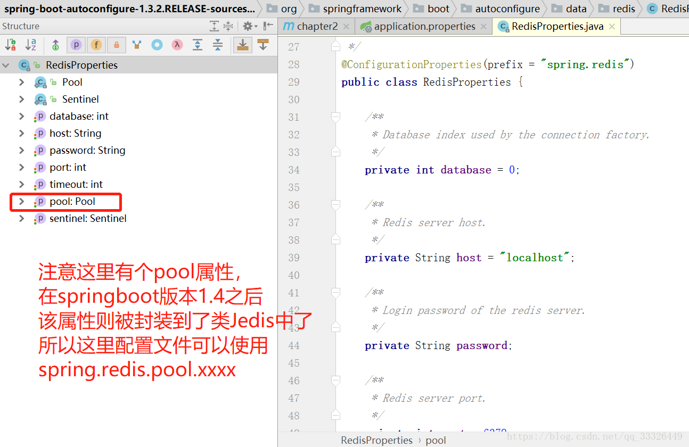
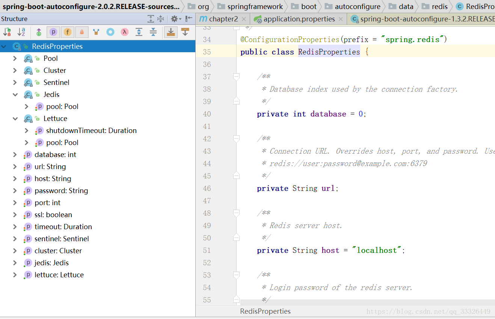

#springboot中各个版本的redis配置问题
　　今天在springboot中使用数据库，springboot版本为2.0.2.RELEASE,通过pom引入jar包，配置文件application.properties中的redis配置文件报错，提示例如deprecated configuration property 'spring.redis.pool.max-active'，猜想应该是版本不对，发现springboot在1.4前后集成redis发生了一些变化。下面截图看下。
##一、不同版本RedisProperties的区别
　　这是springboot版本为1.3.2RELEASE中的RedisProperties配置文件类，从图片中可以看得出来该本的redis配置文件属性有两个内部静态类分别是Pool和Sentinel，七个属性变量。列入我们想在配置文件中设置redis数据库host地址，则可以这样写

　　spring.redis.host=localhost    host为属性,配置连接池的最大连接数 spring.redis.pool.max-active=8

　　这个是redis在application.properties中springboot低版本的配置
```
# REDIS (RedisProperties)
# Redis数据库索引（默认为0）
spring.redis.database=0
# Redis服务器地址
spring.redis.host=localhost
# Redis服务器连接端口
spring.redis.port=6379
# Redis服务器连接密码（默认为空）
spring.redis.password=
# 连接池最大连接数（使用负值表示没有限制）
spring.redis.pool.max-active=8
# 连接池最大阻塞等待时间（使用负值表示没有限制）
spring.redis.pool.max-wait=-1
# 连接池中的最大空闲连接
spring.redis.pool.max-idle=8
# 连接池中的最小空闲连接
spring.redis.pool.min-idle=0
# 连接超时时间（毫秒）
spring.redis.timeout=0
```
　　下图则是springboot版本为2.0.2RELEASE中的RedisProperties配置文件类，从图中可知pool属性则被封装到了内部静态类Jedis和Lettuce中去了，这时我们要是配置连接池的最大连接数,前缀还是spring.redis，有两种途径

　　spring.redis.jedis.pool.max-active=8  或者 spring.redis.lettuce.pool.max-active=8
 
　　这个是redis在application.properties中springboot高版本的配置
```
# REDIS (RedisProperties)
# Redis数据库索引（默认为0）
spring.redis.database=0
# Redis服务器地址
spring.redis.host=localhost
# Redis服务器连接端口
spring.redis.port=6379
# Redis服务器连接密码（默认为空）
spring.redis.password=
# 连接池最大连接数（使用负值表示没有限制）
spring.redis.jedis.pool.max-active=8
# 连接池最大阻塞等待时间（使用负值表示没有限制）
spring.redis.jedis.pool.max-wait=-1
# 连接池中的最大空闲连接
spring.redis.jedis.pool.max-idle=8
# 连接池中的最小空闲连接
spring.redis.jedis.pool.min-idle=0
# 连接超时时间（毫秒）
spring.redis.timeout=0
```
##2、maven下pom中的坐标配置
* springboot版本1.4以下
```
<!--引入 spring-boot-starter-redis(1.4版本前)-->
<dependency>
    <groupId>org.springframework.boot</groupId>
    <artifactId>spring-boot-starter-redis</artifactId>
    <version>1.3.2.RELEASE</version>
</dependency> 
```
* springboot版本1.4以上
```
<!--引入 spring-boot-starter-data-redis(1.4版本后)多了个data加个红和粗吧-->
<dependency>
    <groupId>org.springframework.boot</groupId>
    <artifactId>spring-boot-starter-data-redis</artifactId>
</dependency>
<dependency>
    <groupId>redis.clients</groupId>
    <artifactId>jedis</artifactId>
</dependency>
```
