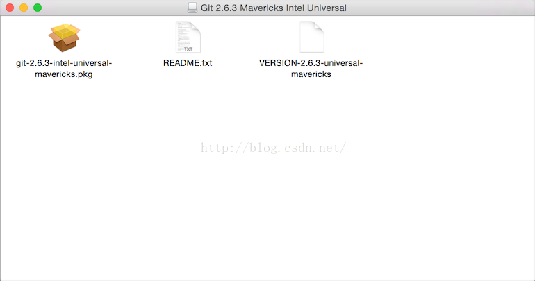
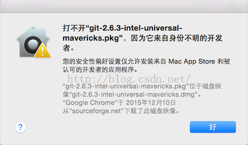
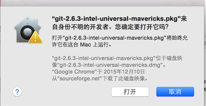
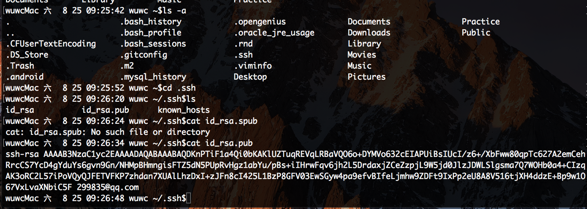
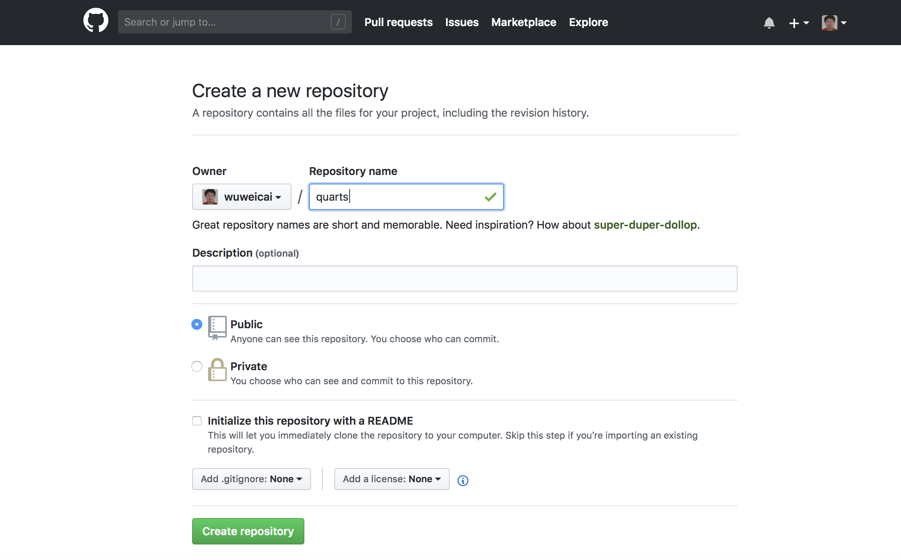
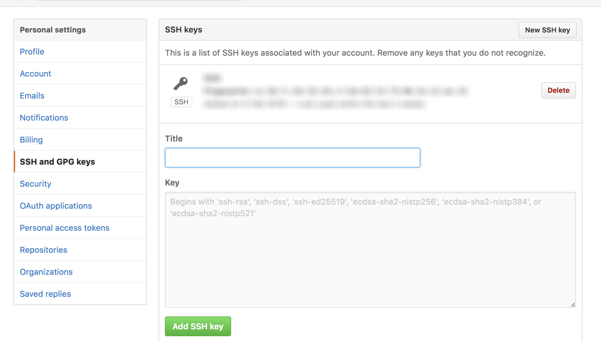
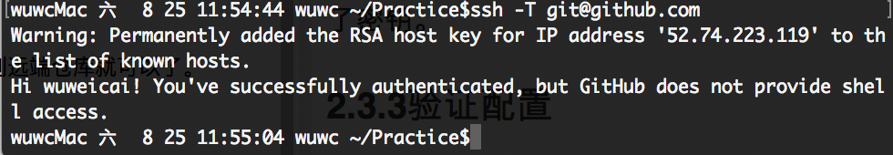
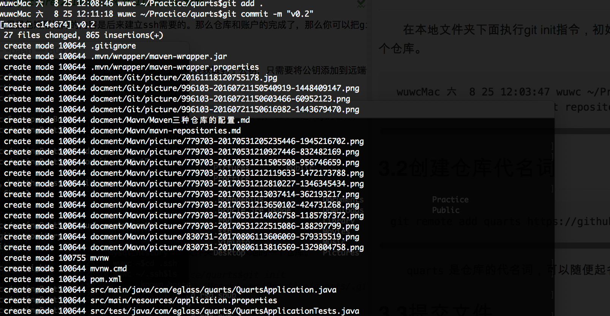

#mac下git安装和使用
##一、安装git
　　1、下载git客户端，下载地址为：https://git-scm.com/download/mac

　　2、打开安装包，可以看到此时的界面为：

　　

　　我们需要把.pkg的安装包安装到系统当中。我双击了安装包之后，结果无法安装成功。界面为：

　　

　　这里是一个坑，虽然是很简单的问题的，但是对于新手而言有时候还是头疼的。后来，在网上终于找到原因，由于这个需要权限，所以直接点击安装是无法成功的。方式是按住control键之后，再点击pkg文件。这个时候会弹出安装程序的界面。如
  所示。然后选择打开，就可以完成安装了。
  
　　

　　3、查看安装路径

　　查看git执行文件路径：
```
wuwcMac 六  8 25 08:44:40 wuwc ~$which git
/usr/local/bin/git
wuwcMac 六  8 25 08:44:47 wuwc ~$ls -la /usr/local/bin/git
lrwxr-xr-x  1 root  wheel  14  8 24 22:22 /usr/local/bin/git -> ../git/bin/git
```
　　可以看到安装路径是／usr/local/git

##二、配置git

###2.1基本配置

　　安装好Git后，配置用户名和用户邮箱，以后每次与Git的交互都会使用该信息。
```
git config --global user.name "your_name"  
git config --global user.email "your_email@gmail.com"

***注意：your_name--是在github上注册的用户名，例如我的是"wuweicai"
        your_email@gmail.com是在github上注册使用的邮箱名，例如我的是"299835@qq.com"
```

　　配置信息可以更改，以后想要更改使用上面指令就可以。同时可以使用git config --list指令查看Git的配置信息。

　　Git默认是大小写不敏感的，也就是说，将一个文件名某个字母做了大小写转换的修改Git是忽略这个改动的，导致在同步代码时候会出现错误，所以建议大小把Git设置成大小写敏感。
``` 
git config core.ignorecase false
```
　　***这个设置没有成功，报如下错误：
``` 
wuwcMac 六  8 25 08:58:49 wuwc /usr/local/git$git config core.ignorecase false
fatal: not in a git directory
```
###2.2创建ssh

&#160;&#160;&#160;&#160;&#160;&#160;&#160;&#160;Git关联远端仓库时候需要提供公钥，本地保存私钥，每次与远端仓库交互时候，远端仓库会用公钥来验证交互者身份。使用以下指令生成密钥。

``` 
ssh-keygen -t rsa -C "your_email@youremail.com"
```
　　生成密钥后，在本地的/Users/当前电脑用户/.ssh目录下会生成两个文件id_rsa、id_rsa.pub，id_rsa文件保存的是私钥，保存于本地，id_rsa.pub文件保存的是公钥，需要将里面内容上传到远端仓库。
  
　　获取公钥字符串具体操作如下图。
　　

<center>图-1 获取公钥</center>

* 输入`cd`指令，进入当前用户目录
* 输入`ls` -a指令，查看当前用户目录下所有文件，包括隐藏文件
* 输入`cd .ssh`指令，进入`.ssh`目录
* 输入`ls`指令，查看`.ssh`目录下的文件
* 输入`cat id_rsa.pub`指令，查看`id_rsa.pub`文件中内容

###2.3远端仓库添加密钥

　　转载：https://blog.csdn.net/zengqujia1720/article/details/71123300

####2.3.1申请一个github账号和创建一个仓库

　　在这里你要注意，一定要找一个网络通畅的地方，还有你的用户名一定要小心一些，经常会重复提醒你用户名已经存在。另外密码一定要至少包含一个数字。注册完账号之后，你就需要建立一个仓库，当然免费的用户只能建立一个公共的仓库

　　

　　

　　点击 New respository之后，进入创建仓库界面，只需要输入一个仓库名即可。 
创建完仓库之后你就会看到有个引导界面如下图所示：

　　

　　这里黑色矩形框内的内容是后来建立ssh需要的。那么仓库和账户的完成了，那么你可以把github想象中遥远地方的一个仓库，你想把自己电脑上的文件传输上去，那么你就要建立一条路径，这就是SSH的作用了

####2.3.2添加密钥

　　以GitHub为例子，向远端仓库添加公钥，上面已经获取到了公钥，只需要将公钥添加到远端仓库就可以了。

　　

　　在个人设置页面，左边选中SSH and GPG keys，在右边添加公钥，title是key的名称，可以随便取，可更改，key是上面我们获取到的公钥，填写完毕后点击add SSH key按钮，这样远端就添加到了密钥。

####2.3.3验证配置

　　浏览器github中做完以上部分之后，退出进入git bash命令行中输入

``` 
ssh -T git@github.com
```
　　
#三、实战
##3.1创建本地库
　　在本地文件夹下面执行git init指令，初始化文件夹，作为本地的一个仓库。
```
 wuwcMac 六  8 25 12:03:47 wuwc ~/Practice/quarts$git init
 Reinitialized existing Git repository in /Users/wuwc/Practice/quarts/.git/
```
##3.2创建仓库代名词
```
git remote add quarts https://github.com/wuweicai/quarts.git
```
　　`quarts`是仓库的代名词，可以随便起名
##3.3提交文件
```
git add .
git commit -m "V0.2"
git push quarts master 
```
　　
　　
　　***若再运行命令：`git remote add quarts https://github.com/wuweicai/quarts.git`，会提示错误`fatal: remote quarts already exists.`

　　做完这些你的文件夹里的内容就可以上传到你的github服务器了。

#附录-常用Git指令
* 初始化配置
``` 
git config --global user.name “XXX"
git config --global user.email “XXXX"
```
* 设置大小写敏感
``` 
git config core.ignorecase false
```
* 生成密钥
``` 
ssh-keygen -t rsa -C “your_email”
```
* 将远端代码clone到本地目录
```
git clone <远端git> <本地目录>
```
　　***这里不需要初始化`git init`
* 提交修改
``` 
git add <文件> // 将有修改的文件添加到本地缓存中 git add . 是添加所有修改
git commit -m "本次修改信息" // 提交本次修改，一般是在git add之后操作
git reset . // 撤销add
git rm --cached . // 撤销add
```
* branch相关指令
``` 
git branch -d <branch_name> // 删除某个分支
git branch -D <branch_name> // 强制删除某个分支
git branch -avv // 查看本地分支与远端分支关系，并且显示分支最新一次提交信息
git remote show origin // 查看远端分支间关系
```
* 切换分支
```
git checkout <branch_name>
```
* 以当前分支为蓝本新建分支并切换到新分支
```
git checkout -b <branch_name>
```
* 当前分支合并其他分支
```
git merge <branch_name>
```
* 远端新建分支，其实就是将本地分支推送至远端
```
git push origin <local_branch_name>:<remote_branch_name>
```
* 删除远端分支，其实就是推送了一个空的分支到远端覆盖了原来的远端分支
```
git push origin :<remote_branch_name>
```
* 从远端拉取分支，并建立对应关系
```
git checkout -b <local_branch_name> origin/<remote_branch_name>
// 或者
git branch —track <local_branch_name> origin/<remote_branch_name>
```
* 本地已经存在的分支和远端分支建立对应关系
```
git branch —set-upstream <local_branch_name> origin/<remote_branch_name>
```
* 添加远端库
```
git remote add <远端库代称> <远端库地址>
git clone <远端库地址> <目录>   //不需要git init
```
* 回滚到某一个提交版本
```
git reset --hard/soft <commit_id> // 回滚到某一个版本
git reset --hard/soft HEAD~<num> // 回滚num个提交
git revert <merge_commit_id> -m number // 撤销某一次merge 
```
* 强制远端覆盖本地
``` 
git fetch --all
git reset --hard origin/<remote_branch_name>
```
* 提交日志查看方式
```
git log -p 每一次提交具体差异
git log —stat 显示文件修改差异，没显示具体修改
git log —graph 树形状提交记录，可查看分支合并信息
```
* `git pull —rebase`有冲突后，解决冲突，使用 `git add` .然后使用`git rebase --continue`

* 切换到某个分支，将其他分支的某次提交应用到该分支
```
git checkout <branch_name>
git cherry-pick <commit id>
```
* 前者表示把到之间(左开右闭，不包含start-commit-id)的提交cherry-pick到当前分支；后者表示把到之间(闭区间，包含start-commit-id)的提交cherry-pick到当前分支。
```
git cherry-pick <start-commit-id>..<end-commit-id>
git cherry-pick <start-commit-id>^..<end-commit-id>
```
* tag
    * 新建tag
    ``` 
    git tag <tag_name> //轻量标签
    git tag -a <tag_name> -m "tag_msg" // 附注标签
    git tag -a <tag_name> <commint_id> // 给某次提交添加标签
    ```
    * 删除tag
    ``` 
    git tag -d <tag_name>
    ```
    * 查看tag
    ```
    git tag // 查看所有tag
    git show <tag_name> // 查看某条tag
    ```
    * 提交到远端
    ```
    git push origin <tag_name> // 将某个tag提交到远端
    git push origin –tags // 将所有tag提交到远端
    ```
#结束语
 
　　本篇粗略的介绍了Git的使用，但是对于Git内部的实现和一些具体的使用方法，还是需要自己去深入的了解。关于Git的详细介绍和工作原理，可以查看以下两篇文章。
 
　　[Git教程](http://www.liaoxuefeng.com/wiki/0013739516305929606dd18361248578c67b8067c8c017b000)，里面有介绍到Git的工作原理，可以仔细阅读。
 
　　[Git Community Book中文版](http://gitbook.liuhui998.com/index.html) 介绍了Git具体使用，这本书也是关于Git的一本好书。
 
　　[Git练习](http://learngitbranching.js.org/)，实战练习Git的各种指令。