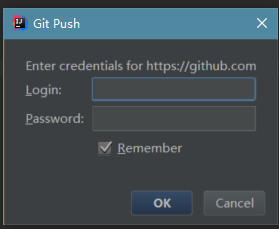
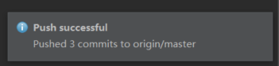

#在IDEA上Git的入门使用（IDEA+Git)
　　转载：https://blog.csdn.net/weixin_39274753/article/details/79722522

　　前言：Git是目前最常用的版本控制系统，而IDEA又是目前日渐流行的ide，因此现在来介绍在IDEA上Git的入门使用。

　　准备：Git、IDEA、GitHub账号
#一、本地创建项目提交到远程库管理 
##1.1开始之前先创建一个简单的测试项目

##1.2将代码交由Git管理

VCS  ——>  Enable Version Control Integration...  
 

——>  选择要使用的版本控制系统，选择Git  ——>  OK

完成后，IDEA下方会出现上述提示。到此，已将本项目与Git进行关联，即已将本项目交由Git管理。
##1.3将代码提交到本地仓库（commit）

将项目交由Git管理后再点击VCS，会发现列举出的选项发生了变化。

VCS  ——>  VCS Operations Popup...

点击VCS Operations Popup...后出现的是Git所能进行的操作，因为是提交到本地，所以点击commit

 ——>  commit...
 
 
 
 然后出现以下窗口，窗口上面部分是选择要提交的文件，Commit Message部分的填写每次提交的备忘信息

——>  commit
 
 
 
提交前IDEA会提醒项目存在问题，选择review会去查看问题，选择commit会忽略问题直接提交。

此处选择的是commit。然后ide下方会出现一条绿色提示

到此已将代码提交到本地仓库。 

需要注意的是，本地仓库地址默认就是项目地址

##1.4查看代码的提交历史

右击项目  ——>  Git  ——>  Show History

屏幕下方的区域会展示项目的提交历史，双击其中选项，会详细展示每一次的提交内容

（此处进行了2次提交，第1次只提交了.java文件，第2次一并提交了该项目的其他文件）

##1.5将代码提交到远程仓库（push）

VCS  ——>  VCS Operations Popup...  ——>  Push...

出现上述窗口，因为还没选择要连接的远程仓库，因此需要明确远程仓库

——>  Define remote

 此处需要远程仓库的url，登陆自己的GitHub，复制某个远程仓库的url
 
 
 
粘贴

 
 
 ——>  OK
 
 
 
 ——>  Push
 
 
 
Git的凭证管理，输入GitHub的帐密
 
 

然后IDEA上也要输入一次，那就输入吧

然后等待push，结果push失败了

 博主也不知道为什么，只在网上找到了解决方法：
 
 
 
 按照网上说的方法一试，真的成功了
 
 
 
 登陆GigHub检查
 
 
 
 提交内容已存在与远程仓库中。到此，push完成。
 
 #二、从远程仓库克隆项目到本地（Clone）

Check out from Version Control  ——>  Git

——> Clone

克隆完成后会询问你是否打开项目

——>  yes

打开项目检查，发现与之前上传的内容一致。到此，已完成从远程仓库克隆代码到本地。

需要注意的是，由于克隆的时候是根据仓库的url进行克隆的，所以会将仓库的所有内容一并克隆。像这次克隆就将博主之前在eclipse用git上传的项目也克隆过来了。

#三、从远程仓库中获取其他用户对项目的修改（pull）
　　可能会有人理解不了这与前者的区别，这里简单说明一下：

* clone——无中生有。原来本地是没有这个项目的，因此将完整的整个项目从仓库clone到本地

* pull——锦上添花。项目1.0已经在本地上存在，但其他人将项目修改成项目2.0并上传到远程仓库。因此你要做的是将远程仓库中别人做的修改部分pull到本地，让你本地的项目1.0成为项目2.0

##3.1说明过后现在开始操作，先是前期准备：

* 首先打开commit用的项目，对其修改，使之升级为项目2.0

* 然后将代码上传到远程仓库

需要注意的是，在push前必须进行commit

否则会显示no commits selected

至于如何上传到远程仓库这里就不在赘述了，可以参照前文。值得提醒的是在commit的时候选择Commit and Push的话，就可以commit和push接连操作。

好的，现在对项目的修改已上传到远程仓库了。

##3.2准备工作完成，现在正式进行pull：
* 打开刚才clone的“项目1.0”

* 嗯，没毛病，还是老样子，现在进行pull，对其更新:

右击项目  ——>  Git  ——>  Repository  ——>  Pull...

（这里很多的选项博主也暂时没搞懂，先暂时忽略）
 
 （这里很多的选项博主也暂时没搞懂，先暂时忽略）
 
 ——>  Pull
 
 
 
 可以看出，原来的代码已作出了更新。下方显示的是更新信息。到此，pull完成。
 
 #总结
1. 要想用git管理项目，先要将本地项目与git关联，才能进行commit、push、pull等操作；
2. 将本地项目于git关联后，本地仓库的地址默认就是项目地址；
3. 从远程仓库进行项目clone后，已默认用git进行项目管理；
4. clone的时候会将仓库里的所有内容一并clone；
5. push之前需要进行commit；

　　本文对如何在IDEA上使用Git作了简要说明，能满足基本的开发需求。但Git的分支操作、版本回退等重要功能本文并未涉及，是因为博主对Git的使用还不够了解，未能悟到其精髓，这需要留到日后再进行补充。