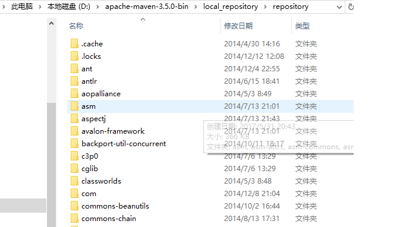
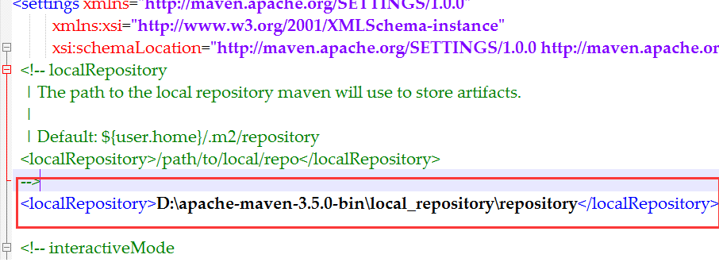
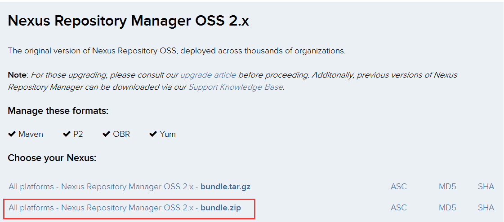
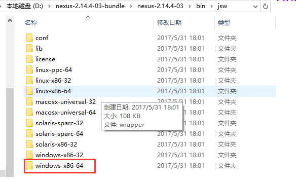
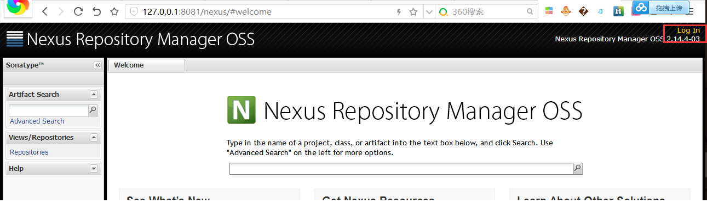
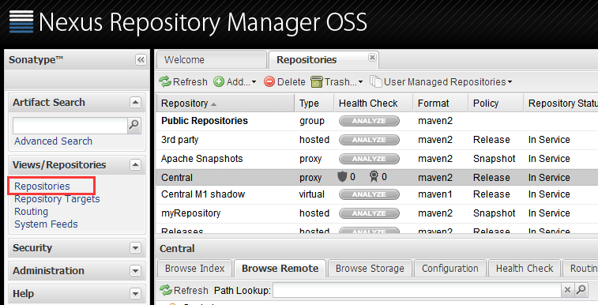
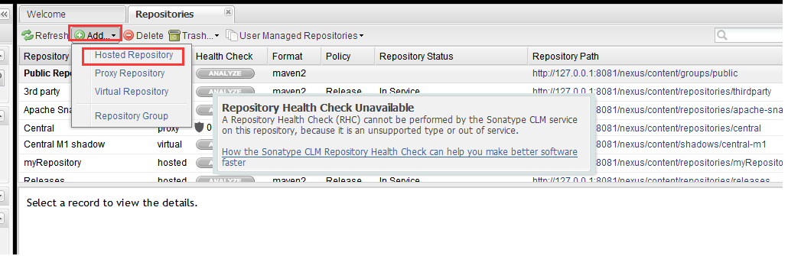
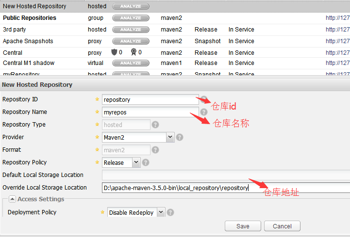
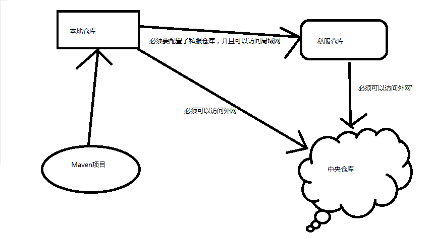

#Maven三种仓库的配置
　　转载：https://www.cnblogs.com/jack1995/p/6925879.html
##一、本地仓库的配置
　　在第一篇中我们介绍过，Maven的仓库有三类，这里不再介绍。

　　1、要创建本地仓库我们需要有相应的jar包文件，本人经过长时间的寻找和积累，已经有了一个jar包仓库，现将此jar包提供给大家使用。下载地址：http://pan.baidu.com/s/1jH77z2Q。

　　2、将下载先来的仓库文件解压到你要存放的地方。文件解压后有1.13G大小，请合理选择存放地方。解压后目录如图：

　　
　　
　　3、配置Maven的本地仓库。

　　在Maven的安装目录下的conf目录下找到settings.xml文件，打开该文件，修改如下部分：

　　
##二、 私服仓库的配置
　　私服仓库的配置比较复杂。

　　1、 下载sonatype Nexus来搭建私服

　　我们可以自己去下载https://www.sonatype.com/download-oss-sonatype。下载如下文件。下载速度比较慢，这里提供一个自己的百度云盘下载链接，大家可以去网盘下载：http://pan.baidu.com/s/1gfcLFzl。

　　

　　下载该文件后对该文件进行解压缩，进入D:\nexus-2.14.4-03-bundle\nexus-2.14.4-03\bin\jsw目录下可以看到很多文件夹，然后根据自己机器的操作系统选择相应的目录，本文以64位Windows操作系统为例。

　　

　　2、 安装nexus服务

　　运行该目录下的install-nexus.bat文件（右击以管理员身份运行），该窗口会一闪而过，然后运行start-nexus.bat文件，等该文件运行窗口关闭后，在浏览器访问http://127.0.0.1:8081/nexus/。就会看到该欢迎页面。

　　

　　3、创建私服仓库　

　　然后点击右上角的log in 进行登录，默认用户名：admin，密码：admin123。登陆后在右边选项卡 Views/Repositories下选择 Repositories就可以看到所有仓库，该地方不做过多的介绍，只介绍如何进行私服仓库配置。

　　

　　选择上方的add按钮，然后选择hosted Repositiry创建一个本机仓库，填入仓库相应的信息即可创建成功。

　　

　　

　　4、配置私服信息
  
　　和本地仓库一样，私服仓库也需要在setting.xml中进行配置，这样才能够访问。
  
　　在setting.xml 文件中找到<profiles></profiles>标签，在其中插入如下代码，其中的id，name标签内的内容必须要和在nexus中创建仓库是所填的仓库ID和仓库名称一致，URL标签内的内容就是该仓库创建后后面显示的地址。
```
<profile>
    <id>localRepository</id>
    <repositories>
        <repository>
            <id>myRepository</id>
            <name>myRepository</name>
            <url>http://127.0.0.1:8081/nexus/content/repositories/myRepository/</url>
            <releases>
                <enabled>true</enabled>
            </releases>
            <snapshots>
                <enabled>true</enabled>
            </snapshots>
        </repository>
    </repositories>
</profile>
```
　　然后还必须要激活改配置，在setting.xml文件的<activeProfiles></activeProfiles>标签内插入如下代码段。
```
<activeProfile>localRepository</activeProfile>
```
　　配置分发构建到私服的验证，在setting.xml文件的<servers></servers>标签内插入如下代码段
```
<server>
  <id>myRepo</id>
  <username>admin</username>
  <password>admin123</password>
</server>
```
　　至此私服仓库就配置成功了。
#三、中央仓库的配置
　　配置中央仓库和配置私服仓库类似：

　　1、在setting.xml 文件中找到<profiles></profiles>标签，在其中插入如下代码，其中的id，name标签内的内容必须要和在nexus中创建仓库是所填的仓库ID和仓库名称一致，URL标签内的内容就是该仓库创建后后面显示的地址。
```
<profile>  
    <id>central</id>  
    <repositories>
        <repository>
            <id>Central</id>
            <name>Central</name>
            <url>http://repo1.maven.org/maven2/</url>
            <releases>
                <enabled>true</enabled>
            </releases>
            <snapshots>
                <enabled>true</enabled>
            </snapshots>
        </repository>
    </repositories>
</profile>
```

　　2、然后还必须要激活改配置，在setting.xml文件的<activeProfiles></activeProfiles>标签内插入如下代码段。

```
<activeProfile>central</activeProfile> 
```
#四、三个仓库之间的关系
　　三者之间的关系是，当我们在项目中依赖一个jar包时，Maven程序会先去本地仓库中找，如果没找到就回去私服找，如果还是没有，最后就回去中央仓库找。其过程如下图：
　　
