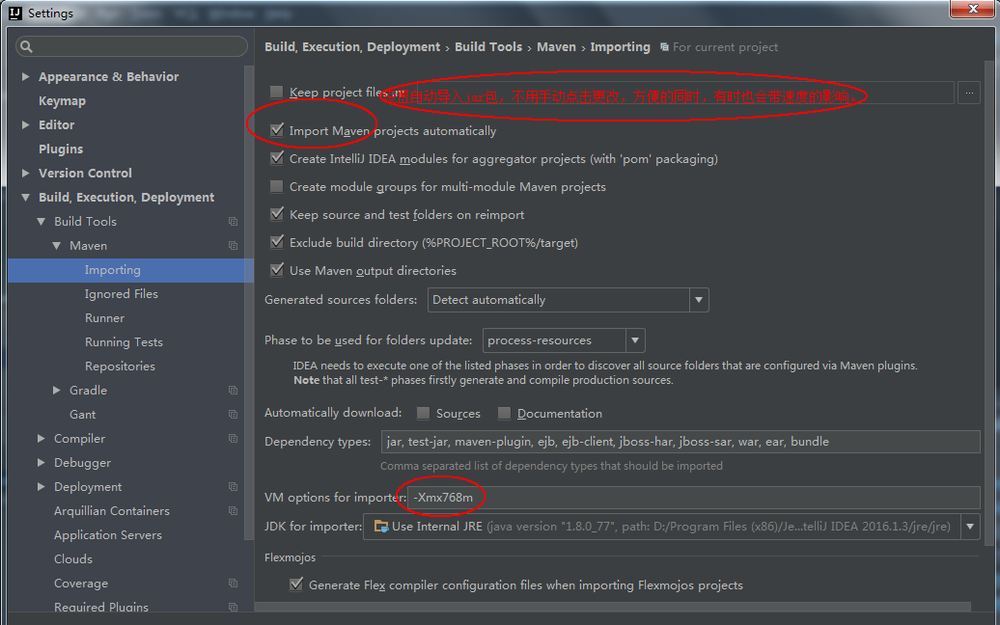

#maven配置多仓库的方法
　　刚接触maven就是在公司里配置好的，所以一直以来使用都没毛病，所以一直没有去动这些固有的东西。

　　但是，后来把公司的电脑拿回家之后，发现有的东西就搞不起来了。原因也看一下就明白了，因为在公司的时候用的是公司的maven私服，所以回家后，用不了也是正常。

　　但是，真的脱离了公司，自己就不能工作了吗？不可能吧。 难道一下开源工具都必须要依赖于公司的网络？ 这明显是不合理的。

　　那么，就扯出本次文章的意义了，在家里，自然是要公有的maven仓库了，那么，怎样配置maven仓库才能让自己用起来顺心呢？
##1. 改掉原有的maven仓库地址，让maven从公网上摘取jar包下载，方便、快捷。
  
  　　原私有配置示例如下：
```
<?xml version="1.0" encoding="UTF-8"?>  
<settings xmlns="http://maven.apache.org/SETTINGS/1.0.0"   
              xmlns:xsi="http://www.w3.org/2001/XMLSchema-instance"   
              xsi:schemaLocation="http://maven.apache.org/SETTINGS/1.0.0 http://maven.apache.org/xsd/settings-1.0.0.xsd">  
      <!-- localRepository   
       | The path to the local repository maven will use to store artifacts.  
       |  
       | Default: ${user.home}/.m2/repository -->  
      <localRepository>${user.home}/.m2/repository</localRepository>  
      <!--pluginGroups></pluginGroups-->   
      <!--proxies></proxies-->  
      <servers>  
        <server>  
            <id>releases</id>  
            <username>admin</username>  
            <password>123</password>  
        </server>  
        <server>  
            <id>snapshots</id>  
            <username>admin</username>  
            <password>123</password>  
        </server>     
      </servers> 
     <pluginRepositories>
        <pluginRepository>
            <id>mypublic</id>
            <name>Public</name>
            <url>http://test.nexus.com/nexus/content/groups/public/</url>
        </pluginRepository>
     </pluginRepositories>
      <mirrors>  
        <mirror>    
            <id>central</id>    
            <name>internal</name>    
            <url>http://test.nexus.com/nexus/content/groups/public/</url>    
            <mirrorOf>central</mirrorOf> 
        </mirror>  
      </mirrors>  
    <profiles>  
        <profile>  
              <id>nexus</id>  
              <!--Enable snapshots for the built in central repo to direct -->  
              <!--all requests to nexus via the mirror -->  
              <repositories>  
                <repository>  
                    <id>central</id>  
                    <url>http://central</url>  
                    <releases><enabled>true</enabled></releases>  
                    <snapshots>
                        <enabled>true</enabled>
                        <updatePolicy>always</updatePolicy>
                    </snapshots>  
                </repository>
              </repositories>
             <pluginRepositories>  
                <pluginRepository>  
                  <id>central</id>  
                  <url>http://central</url>  
                  <releases><enabled>true</enabled></releases>  
                  <snapshots><enabled>true</enabled></snapshots>  
                </pluginRepository>
             </pluginRepositories>  
        </profile> 
    </profiles>  
  <activeProfiles>  
    <!--make the profile active all the time -->  
    <activeProfile>nexus</activeProfile>  
  </activeProfiles>  
</settings>  
```

　　如果想直接把私有的地方干掉，那么，这是最快的，直接把mirror的url改掉就行了，如：

```
 <mirrors>  
        <mirror>    
            <id>central</id>    
            <name>internal</name>
    　　　　 <url>http://maven.aliyun.com/nexus/content/groups/public/</url>
    　　　　 <!-- <url>http://test.nexus.com/nexus/content/groups/public/</url> -->    
            <mirrorOf>central</mirrorOf> 
        </mirror>  
      </mirrors> 
```
　　当然了，到需要的地方，再把这个地址改回来就可以了，这可能是改动最小的方法了。

###2. 添加一个类似结构的仓库配置，这样的话就不切来切去的了，一劳永逸。

　　相当于添加了多仓库，如下：

```
<mirrors>
    <!-- 再添加一个mirror, 注意mirrorsOf 为 * -->
    <mirror>
        <id>alimaven</id>
        <name>aliyun maven</name>
        <url>http://maven.aliyun.com/nexus/content/groups/public/</url>
        <mirrorOf>*</mirrorOf>
    </mirror>        
</mirrors> 

<repositories>
    <!-- 添加一个 repository -->
    <repository>  
        <id>alimaven</id>  
        <url>http://alimaven</url>  
        <releases><enabled>true</enabled></releases>  
        <snapshots>
            <enabled>true</enabled>
            <updatePolicy>always</updatePolicy>
        </snapshots>  
    </repository>
</repositories>
```
　　这样的话，就不用再切换了。但是，这会导致一种情况，在某环境不可用时，maven下载jar将会很慢，严重影响心情，所以，其实是不建议这么干的。

##3. 按照最简单的方式，新增一个仓库地址，随时切换。

　　不用去添加mirror了，直接以url的形式，配置到reponsitory里即可，如下：

```
<repository>    
    <!-- 直接添加一个 repository 即可 -->
    <id>repo1</id>    
    <name>org.maven.repo1</name>    
    <layout>default</layout>  
    <url>https://repo1.maven.org/</url>    
    <snapshots>    
        <enabled>false</enabled>    
    </snapshots>    
</repository>
```
##4. 另附一个idea maven配置的方法：




　　maven作为基础辅助工具，虽不需秀深入的理解，也没有高深的技巧，但是作为没有处理过几个相关问题的同学，还是很有必要了解的。

　　在处理问题的过程，一步步成长了。

　　毕竟，资深工程师，没有解决过很多bug，是不能成为资深的。